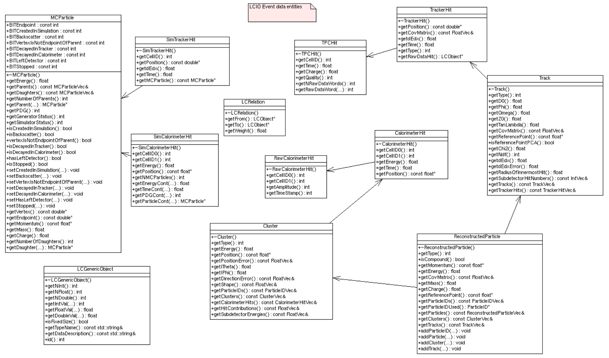

# DD4HEP

A repository for work on SiD for use with the DD4hep toolkit, started by Gabriel Penn as a summer student in 2016. Please feel free to direct any queries to gp13181@bristol.ac.uk.

# Getting started
These instructions assume you are SSHing to a UoB SL7 machine (e.g. sc01) with access to cvmfs. ILCSoft libraries are available on cvmfs, so you will not need to install DD4hep, LCIO, Marlin etc locally.

These instructions are based on [those provided by Dr Aidan Robson (Glasgow)](https://twiki.ppe.gla.ac.uk/bin/view/LinearCollider/GlaSiDGettingStarted), which you may find to be more up-to-date but less tailored to our setups.

## Quick start
```
mkdir iLC
cd iLC
git clone https://github.com/Bristol-SiD-Development/DD4HEP.git
cd DD4HEP
git checkout -b developPK origin/developPK
source /cvmfs/ilc.desy.de/sw/x86_64_gcc82_centos7/v02-02/init_ilcsoft.sh
./auto/muonCATscripts/2pT_500_theta85_starter.sh
```
You can check the output with
```
anajob recoedFiles/reco_SiT_CAT_500_2pT_theta85_starter.slcio > anaj.txt
```
For the detail of what is happening in these commands go to the [QS-breakdown](#qs-breakdown) section.
# Directories:
 - init: initialisation scripts for environment setup
 - SiD/compact: detector descriptions (adapted from the SiD description included with lcgeo)
 - gunScripts: particle gun scripts for producing input MC particles
 - mcpFiles: source MC .slcio files to be fed into to ddsim
 - ddsimFiles: detector simulated ddsim .slcio files to be fed into to Marlin
 - MarlinXMLs: reconstruction steering files for Marlin
 - recoedFiles: store reconstructed .slcio and root files
 - analysis: pyLCIO analysis scripts, adapted from Josh Tingey's pixel studies (see pixelStudies repo)
 - auto: miscellaneous shell scripts for submitting multiple jobs or running the full chain


# iLCSoft environment
Start by setting up your environment. You will have to do this every time you start a new session, either with
```
source /cvmfs/ilc.desy.de/sw/x86_64_gcc82_centos7/v02-02/init_ilcsoft.sh
```
... or more efficiently by adding the following to your ~/.bashrc: (remeber to restart shell session after)
```
alias ilcsoft="source /cvmfs/ilc.desy.de/sw/x86_64_gcc82_centos7/v02-02/init_ilcsoft.sh"
```
so running `ilcsoft` will setup the environment.

N.B. if an iLCSoft init script is run more than once in a shell session it will cause Marlin duplicate library loading issues. Start over from a clean terminal.
# LCIO

LCIO (**L**inear **C**ollider **I/O**) is a persistency framework and event data model for linear collider detector studies used across different linear collider experiments. This format is used for for all simulation and analysis work on this project at Bristol. A file in this format has the `.slcio` extension.

LCIO is based on the idea of having a named 'Collection' (associated group of objects) of a given type (or data entitiy) to store information. The Collections are generally named in the underlying C++ code. Each data entity has associated 'getter methods' which can be called to extract information from an object or to move to an associated object of a different entity type (e.g. from a Simulated hit to the Monte Carlo particle that caused it). These enities and getter methods are shown below. The arrows indicate types that you can move between with a getter method, this ability to move beetween types is a result of a 'relation'. These relations may also be coded in via a *LCRelation* (see centre of diagram), for example a relation is often added from a *SimTrackerHit -> TrackerHit*. Note that when moving from one type to another the getter method often only returns a pointer or refernce to the first elememt of the new type (c.f. the underlying C++), which you then have to iterate through.

The [anajob](#summary-checks) command is the best way to find the Collection names and types in your sample. 



Further detail on LCIO can be found [here](https://inspirehep.net/files/b4997a1c1ef975c1c91a4d462c101267) - including a couple of helpful diagrams for getting your head around the format and the differnces between groups of data entities.

Full definitions of the LCIO object types and their getter methods (member functions) the [documentation](https://ilcsoft.desy.de/LCIO/current/doc/doxygen_api/html/namespaceEVENT.html) page is useful.


# Running a simulation
There are three steps in running the full chain. 
1) Particle generation - particle gun or a physics sample
2) Detector simulation - via a ddsim command
3) Reconstruction - via a Marlin command, controlled by a xml script

*File naming conventions are included in the README in the relevant directories.*
## Generating input particles

For simple input events (e.g. test muons), modify a copy of an gunScripts/lcio_particle_gun_xxx.py to generate the desired particles. The particle type (PDG), momentum, phi, and theta can be changed easily. The scripts in this directory are modified from the cannonical script to give sucessive event numbers across a run with multiple momenta.

For physics events (e.g. an ILC collision), you should seek out ready-made input files, ideally in .slcio format. Older ones may use the .stdhep format, which should be compatible but may cause problems in some cases.\
Some of these can be found at:
`###UPADTE when stored on sc01###`

## Running detector simulation

From the ddsimFiles directory, run the following:

```
ddsim --compactFile=../SiD/compact/[GEOMETRY] --runType=batch --inputFile=[INPUT PATH] -N=[EVENTS] --outputFile=[OUTPUT PATH]
```
 - [GEOMETRY]: the path to the master .xml file for the chosen geometry
 - [INPUT PATH]: the path to the .slcio file containing the input particles. These should be contained in the mcpFiles directory
 - [EVENTS]: the desired number of events (you will of course need to have enough events in the input file!)
 - [OUTPUT PATH]: the path to the desired output file (must be .slcio)

This will simulate the events, which can then be reconstructed with Marlin.  
Make sure to use the correct detector geometry and include this information in the output file name.

Putting this all together, using the quick start example gives
```
ddsim --compactFile=../SiD/compact/SiD_o2_v03/SiD_o2_v03.xml --runType=batch --inputFile ../mcpFiles/mcparticles_500_2pT_theta85_starter.slcio -N=500 --outputFile=SiD_o2_v03_ddsim_500_2pT_theta85_starter.slcio
```

## Reconstructing events - Marlin

Event reconstruction is done with the Marlin package. This to controlled via a .xml steering file which states the reconstruction modules to be run and the parameters passed to them.
It is best to work from existing .xmls and tailor them to your needs, so a good start could be to modify a copy of `MarlinXMLs/muon_CAT_studies/mySiDReconstruction_o2_v03_calib1_500_2pT_theta85_starter.xml` by looking at the following parameters:
 - LCIOInputFiles: path to the input file (the detector simulation output file, usually in ddsimFiles)
 - DD4hepXMLFile: path to the master geometry file - this MUST be the same one that was used for the simulation
 - LCIOOutputFile: path to the desired .slcio output file.
 - FileName: path to the desired .root histograms output file.
The three file name/path parameters can be eaily found by searching for "EDIT". 

**N.B. relative file paths in the Marlin .xml are relative to the location of the exceution of the *command* (usually recoedFiles) NOT the location of the .xml file**  

Warnings/errors about too many tracks being created are ok - this is the conformal algorithm doing it's job and it will change its parameters to help.

-------------------------------------------------------------------
### Marlin .xml breakdown

Marlin works by running a sucession of processor modules (written in C++, mostly distributed via /cvmfs/). The path to these modules is set via the `init_ilcsoft.sh` environment script. This path can be checked by looking at the Marlin libray list path variable with `echo $MARLIN_DLL`. The two 'steup' modules and the 'output' module should always be used and in their given order. Any combination of other modules can be used in between. 

The code for the modules can be found in the subdirectories of the `$ILCSOFT` directory or on the [iLCSoft GitHub](https://github.com/iLCSoft) page by searching for the relevant repository name. It is worth looking at both the header files and the main file to see all parameters and their defaults as they are not always given in the .xml. The defaults also provide clues on how and what to pass as parameters in the .xml.

If you need to edit the modules please see [Editing Marlin modules](#editing-marlin-modules).

A Marlin .xml has three main sections, the **execute** block, the **global** block and the **processor** blocks.  

The **execute** block defines given names to the modules *within the .xml* to be run and the order in which they are executed. This allows the same module to be run with differnt inputs or parameters under a different name in the .xml file. The given name in the **execute** block must corespond to the name used in a **processor** block. Modules can be easily turned on/off by commenting them out in this block.

The **global** block defines global variables to be used across all processors, notably the input detector simulated .slcio file and the gear .xml file. Which event numbers to run on are also controlled here.

What follows is a **processor** block for each module you want to run. The order of these blocks is immaterial. Extra **processor** blocks may safely be left in a .xml for future use as they have no effect if not called in the **execute** block.  
The first line of the block has the form 
```
<processor name="[Name given in execute]" type="[Name of module]">
```
 The name *must* match that used in the **execute** block, the type *must* match the name of the module as it appears in the iLCSoft source directory, e.g. 
 ```
 <processor name="MyConformalTracking" type="ConformalTracking">
 ```
 corresponds to a module in `/cvmfs/ilc.desy.de/sw/x86_64_gcc82_centos7/v02-02/ConformalTracking/v01-10/src`.

A parameter is fully defined in the module C++ source code and header files, and to find what should go in the Marlin .xml takes a little decoding.  
In the header file the C++ type of all the named member variables (m_variableName) is found i.e. `std::vector<std::string>` which coresponds to a Marlin `type="StringVec"`. Look through .xml files to find examples of the correct 'Marlin type' terms.  
This member variable can then be found in the main C++ file in a 'register' function which has the structure:
```
registerFunction("xml keyword", "Parameter description", m_variableName, default value)
```

Taking three examples from the starter Marlin .xml, we can see parameters are set in the .xml in the following way:
```
<parameter name="TrackerHitCollectionNames" type="StringVec" lcioInType="TrackerHitPlane"> SiVertexBarrelHitsPlanes SiVertexEndcapHitsPlanes SiTrackerBarrelHitsPlanes SiTrackerEndcapHitsPlanes </parameter>

<parameter name="RelationsNames" type="StringVec" lcioInType="LCRelation"> SiVertexBarrelHitsRelations SiVertexEndcapHitsRelations SiTrackerBarrelHitsRelations SiTrackerEndcapHitsRelations</parameter>

<parameter name="ThetaRange" type="double"> 0.025 </parameter>

# Or summarised as...

<parameter name="[xml keyword]" type="[C++ (LCIO version) object type]" lcioInType="[LCIO object type]"> [Parameter value(s)] </parameter>
```
There are a few points to note...  

1) A lcioType is not always required. It is needed for LCIO structures (see the [LCIO section](#lcio)), but not for native C++ types (see difference between first two and third example above).  
2) **Order is important** - within a **processsor** block the order in which collections are passed to a parameter *must* correspond to the order for another parameter. This is seen in the order of hit collections being the same as the order of the hit relation collections in the above snippet.   
3) The xml keyword in the Marlin .xml file must be exactly as defined in the source C++ code.
4) Not all parameters will be set in the Marlin .xml file, many have sensible defaults so do not appear in a processor block. This makes it important to check the source code to know what a module is up to and if you will ever need to change them.

### Pixel size studies
Tracker pixels can be approximated without modifying the geometry files by changing the resolution parameters in the `DDPlanarDigiProcessor` modules. `ResolutionU` and `ResolutionV` are the tracker's resolution in the u and v directions so can be modified for different subdetectors and pixel sizes. 

### Editing Marlin modules
!!!!Info on cloneing e.g. clic repo for edit and use. add to DLL etc.!!!
# QS breakdown
In the quick start example you have reconstructed the path of 500 2 GeV muons with the conformal tracking algorithm. 


`mkdir iLC; cd iLC; git clone ...; cd DD4HEP; git checkout -b developPK origin/developPK` \
This series of commands makes a directory to clone the Bristol DD4HEP repository into, clones it and then grabs the current working branch. 

`source /cvmfs/ilc.desy.de/sw/x86_64_gcc82_centos7/v02-02/init_ilcsoft.sh` sets up the iLCSoft environment from the cvmfs distribution mounted to the machine. LCIO, DD4hep, Marlin etc. can all now be fetched and used.

`./auto/muonCATscripts/2pT_500_theta85_starter.sh` runs a shell script that excecutes the chain in sequence from particle generation, through detector simulation to reconstruction.

**2pT_500_theta85_starter.sh**

The relative paths are set such that the script should be called from the DD4HEP repository root directory.
`2pT_500_theta85_starter.sh` is broken down in the comments below:
```
# shebang - required for an excecutable shell script
#!/bin/sh  


# run particle gun script and output in mcpFiles dir
cd mcpFiles/
python ../gunScripts/lcio_particle_gun_500_2pT_theta85_starter.py 

# run detector simulation on the SiD_o2_v03 geometry and output in ddsimFiles dir
cd ../ddsimFiles/
ddsim --compactFile=../SiD/compact/SiD_o2_v03/SiD_o2_v03.xml --runType=batch --inputFile ../mcpFiles/mcparticles_500_2pT_theta85_starter.slcio -N=500 --outputFile=SiD_o2_v03_ddsim_500_2pT_theta85_starter.slcio 

# run Marlin reconstruction and output in recoedFiles dir as directed by the .xml file
cd ../recoedFiles/
Marlin ../MarlinXMLs/muon_CAT_studies/mySiDReconstruction_o2_v03_calib1_500_2pT_theta85_starter.xml 
```
## Summary checks

There are two useful commands to quickly inspect a .slcio file. They can be used to look at a .slcio file at any stage of the chain and will give the relevant information available in each case.  

`anajob [PATH TO FILE]` is useful to check LCIO collection names, LCIO object types and gives basic information about each event in an entire file. 

`dumpevent [PATH TO FILE] [evtNum]` provides highly detailed information about a single event in a .slcio file for every LCIO type recorded in the event. 

Both usually output large amounts of text so it is easiest to pipe stdout to a text file, e.g.
```
anajob recoedFiles/reco_SiT_CAT_500_2pT_theta85_starter.slcio > anaj.txt
dumpevent recoedFiles/reco_SiT_CAT_500_2pT_theta85_starter.slcio 4 > devt.txt
```

<!-- 
You should now have a file named 'sitracks.slcio' (or whatever LCIOOutputFile was in the reconstruction file). You can run anajob or dumpevent (see above) to check its contents. -->

<!-- # Running the chain

Here are some general instructions for running the simulatiom->reconstruction->analysis chain. First off, you will need to set up your environment (see above). There is an old master initialisation script for this purpose, init/init_master_new.sh, but does not work for the newest version.


 
Alternatively, if you are a masochist, you can create one from scratch. Then run your reconstruction using Marlin, e.g.

```
Marlin example.xml
```

This will produce a final .slcio file containing the reconstructed tracks, which can then be analysed. -->

## Track parameters


# Analysis

Analysis scripts written by Josh Tingey can be found in the analysis directory. See analysis/README.md for information and instructions. (Note: compatibility work on Josh's scripts is still a work in progress.)
